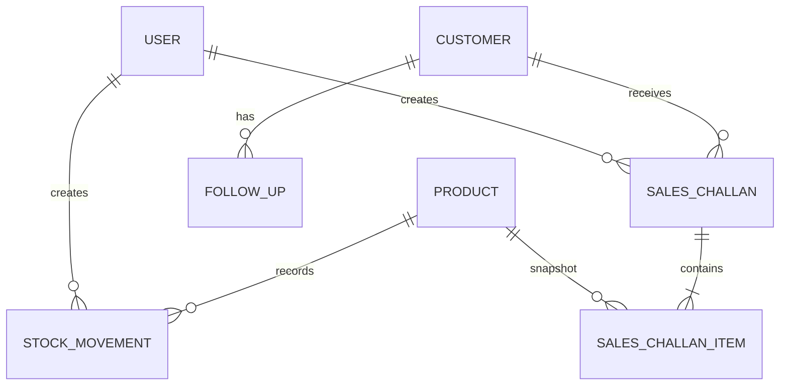

# Data model

```mermaid
erDiagram
  USER ||--o{ STOCK_MOVEMENT : creates
  USER ||--o{ SALES_CHALLAN : creates
  CUSTOMER ||--o{ FOLLOW_UP : has
  CUSTOMER ||--o{ SALES_CHALLAN : receives
  PRODUCT ||--o{ STOCK_MOVEMENT : records
  PRODUCT ||--o{ SALES_CHALLAN_ITEM : snapshot
  SALES_CHALLAN ||--|{ SALES_CHALLAN_ITEM : contains
```

Challan lines retain product name, SKU, and price snapshots. Stock is only decremented inside the confirm transaction, which also writes immutable stock movements.
